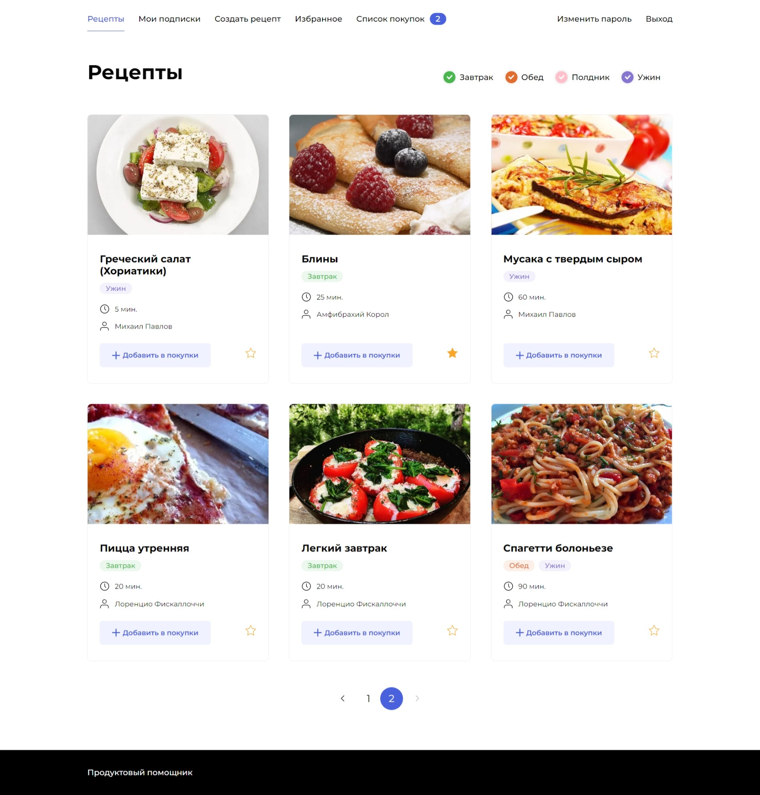

# проект Foodgram 

### Описание проекта:

Foodgram, «Продуктовый помощник».  
На этом сервисе пользователи могут публиковать рецепты, 
подписываться на публикации других пользователей, 
добавлять понравившиеся рецепты в список «Избранное», 
а перед походом в магазин скачивать сводный список продуктов, 
необходимых для приготовления одного или нескольких выбранных блюд.



---

Разработка велась в рамках создания серверной части сервиса и логики его работы, 
организации взаимодействия с базой данных, соединения backend с готовым 
frontend приложением (React), а также создания API проекта на базе 
Django REST framework.  
Проект разворачивается в контейнерах Docker из образов сервисов 'frontend', 
'backend', 'db' (postgres) и 'nginx', с использованием технологий CI/CD 
(continuous integration и continuous deployment) GitHub Actions.  
Сервис frontend подготовит файлы, необходимые для работы фронтенд-приложения, 
а затем прекратит свою работу.  
При внесении изменений в код проекта и отправке в репозиторий GitHub, 
производится автоматическая проверка на соответствие стандарту PEP8. 
После успешного прохождения тестов обновленные Docker-образы 'frontend' и 'backend' 
сохраняются на DockerHub и разворачиваются в Docker-контейнерах на сервере.

### Стек технологий:

- Python 3.11.2
- Django 4.1.7
- Django rest framework 3.14
- Djoser 2.1
- Gunicorn 
- Nginx
- PostgreSQL
- Git
- Docker

---

### Получение проекта:

Форк репозитория с GitHab:

```commandline
https://github.com/mikepavlos/foodgram-project-react.git
```

---

### Запуск проекта локально в Docker-контейнерах:

Перейти в директорию `infra/`, создать файл `.env`, заполнить его по образцу:

```text
DB_ENGINE=django.db.backends.postgresql # указываем, что работаем с postgresql
DB_NAME=postgres                        # имя базы данных
POSTGRES_USER=postgres                  # логин для подключения к базе данных
POSTGRES_PASSWORD=postgres              # пароль для подключения к БД (установите свой)
DB_HOST=db                              # название сервиса (контейнера)
DB_PORT=5432                            # порт для подключения к БД
SECRET_KEY=top_secret                   # секретный ключ джанго-проекта
ALLOWED_HOSTS=localhost                 # локальный хост, 127.0.0.1, [::1] или *
CSRF_TRUSTED_ORIGINS=http://localhost   # доверенный хост (соответственно, локальный)
```

В файле `docker-compose.yml` в настройках сервиса `backend` либо оставить 
скачивание образа приложения с DockerHub, либо вместо команды `image` 
прописать `build` для сборки образа из проекта.

```yaml
  backend:
    image: miha1is/foodgram-backend:latest
    # build: ../backend
    restart: always
...
```

То же самое предложение для сервиса `frontend`.  

Выполнить команду развертывания контейнеров проекта:

```commandline
docker-compose up -d
```

---

### Запуск проекта на сервере:

#### Подготовка GitHub Actions:

После создания репозитория в своем аккаунте GitHub во вкладке настроек 
репозитория проекта, в меню выбрать `Secrets and variables` выбрать `Actions`, 
нажать кнопку `New repository secret`, создать переменные окружения:

| Секрет               | Значение                                                                               |
|----------------------|----------------------------------------------------------------------------------------|
| SECRET_KEY           | "секретный ключ джанго-проекта" в кавычках                                             |
| ALLOWED_HOSTS        | *, хост сервера                                                                        |
| CSRF_TRUSTED_ORIGINS | доверенные хосты для проверки CSRF (http://... https://...)                            |
| DOCKER_USERNAME      | имя пользователя в DockerHub                                                           |
| DOCKER_PASSWORD      | пароль доступа в DockerHub                                                             |
| DB_ENGINE            | django.db.backends.postgresql                                                          |
| DB_NAME              | имя базы данных                                                                        |
| POSTGRES_USER        | логин для подключения к базе данных                                                    |
| POSTGRES_PASSWORD    | пароль для подключения к БД                                                            |
| DB_HOST              | db                                                                                     |
| DB_PORT              | 5432                                                                                   |
| USER                 | логин сервера                                                                          |
| HOST                 | ip сервера                                                                             |
| SSH_KEY              | приватный ключ локальной машины, по которому происходит вход на сервер (~/.ssh/id_rsa) |
| PASSPHRASE           | фраза-пароль ключа ssh (если установлена)                                              |
| TELEGRAM_TO          | id телеграм-чата (@userinfobot)                                                        |
| TELEGRAM_TOKEN       | токен телеграм-бота (@BotFather - /mybots - Choose a bot - API Token)                  |


#### Подготовка сервера:

Войти на свой удаленный сервер.
Установить Docker и docker-compose.

```commandline
sudo apt install docker.io
```

```commandline
sudo curl -L "https://github.com/docker/compose/releases/download/1.29.2/docker-compose-$(uname -s)-$(uname -m)" -o /usr/local/bin/docker-compose
```

```commandline
sudo chmod +x /usr/local/bin/docker-compose
```

Из паки `infra` локального проекта cкопировать на сервер в домашнюю дирректорию 
файлы настроек nginx и docker-compose

```commandline
scp docker-compose.yaml <USER>@<HOST>:/home/<USER>
```

```commandline
scp nginx.conf <USER>@<HOST>:/home/<USER>
```

Запуск при любом `push` на GitHub проект:
- тестируется на соответствие PEP8, 
- обновляются и сохраняются на DockerHub образы `backend` и `frontend`, 
- в домашней директории сервера автоматически создается файл `.env`
- проект автоматически разворачивается на сервере, 
- о чем приходит сообщение на telegram.

Для запуска сервиса на сервере вручную:  
- на сервере в домашней директории создать файл `.env` с настройками 
по образцу выше с учетом данных хоста.

```commandline
nano .env
```

- запуск

```commandline
sudo docker-compose up -d
```

--- 
После успешного развертывания проекта на сервере или локально:  
Выполнить миграции, создать суперпользователя, собрать статику

```commandline
sudo docker-compose exec backend python manage.py migrate
```

```commandline
sudo docker-compose exec backend python manage.py createsuperuser
```

```commandline
sudo docker-compose exec backend python manage.py collectstatic --no-input 
```

Для подгрузки в базу данных ингредиентов:

```commandline
sudo docker-compose exec backend python manage.py loaddata dump/ingredients.json
```

В админ-зоне проекта создать необходимые теги (без тегов рецепт создать не удастся)

---

### Работа с сервисом:

Сервис будет доступен:  

при локальном развертывании - http://localhost/  

При развертывании на сервере - http://<ip_адрес_хоста>/  

Доступ к административной части: <host>/admin  
Доступ к API: <host>/api  
Спецификация API: <host>/api/docs

---

### Разработка проекта:

Бэкенд, логика сервиса, соединение с подготовленным фронтендом, CI/CD проекта:  
Михаил Павлов https://github.com/mikepavlos  
email mike_pavlovsky@hotmail.com  
telegram @miha1is
